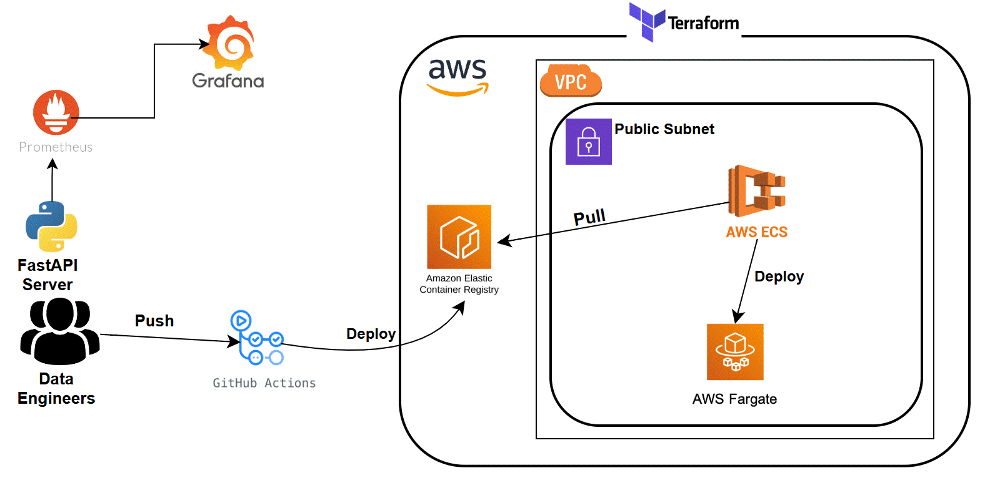
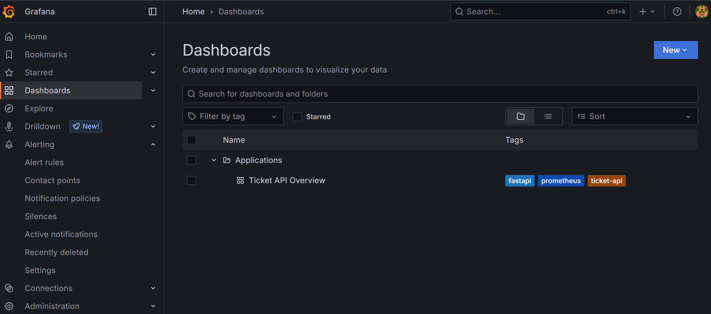
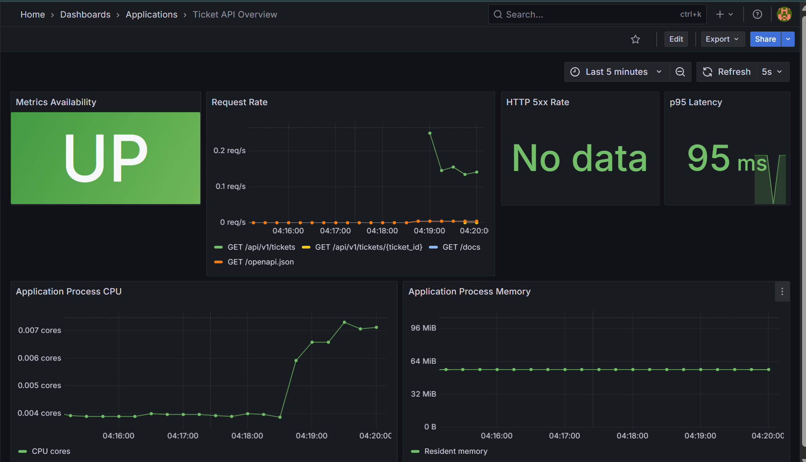

# Ticket API 

This is a FastAPI, CRUD application with an in-memory db deployed to terraform managed AWS resources.
Application metrics are being monitored using prometheus and visualized with grafana



## Setup Instructions
Clone the repository
```bash
  git clone https://github.com/ioaviator/devops_assessment.git
  cd devops_assessment
```

Authenticate using aws cli
```bash
aws configure
```

## Run with Docker

```bash
docker compose up -d --build
```


Open
`http://localhost:8080/docs` for the interactive API documentation.
`http://localhost:9090/targets` for prometheus targets.
`http://localhost:3000` for grafana dashboard.


## Run without Docker

```bash
python -m venv devops_venv
source devops_venv/Scripts/activate or  source devops_venv/bin/activate
pip install -r requirements-dev.txt
uvicorn app.main:app --reload
```

## Run tests

```bash
pytest
```

## Example request

```bash
curl -X POST http://localhost:8080/api/v1/tickets \
  -H 'content-type: application/json' \
  -d '{
    "customer_id": "customer-123",
    "subject": "Payment failed",
    "description": "Card was rejected",
    "priority": "high"
  }'
```

Endpoints:

- `POST /api/v1/tickets`
- `GET /api/v1/tickets`
- `GET /api/v1/tickets/{ticket_id}`
- `PATCH /api/v1/tickets/{ticket_id}`
- `DELETE /api/v1/tickets/{ticket_id}`
- `GET /health/live`


## Deploy AWS resource with terraform

Create an AWS s3 remote backend bucket to be used to manage terraform state

```bash
  # for us east (us-east-1)
  aws s3api create-bucket --bucket my-unique-bucket-name --region us-east-1


  # for other regions
  aws s3api create-bucket --bucket my-unique-bucket-name --region us-west-2 --create-bucket-configuration LocationConstraint=us-west-2

  # enable bucket versioning
  aws s3api put-bucket-versioning --bucket my-unique-bucket-name --versioning-configuration Status=Enabled

  # verify
  aws s3api get-bucket-versioning --bucket my-unique-bucket-name

  # result
  {
    "Status": "Enabled"
  }

```

  Inside the terraform directory, add your bucket name and region in the backend.tf file
  
  ```bash
terraform {
  backend "s3" {
    bucket       = "[terraform-bucket]"
    key          = "global/s3/terraform.tfstate"
    region       = "[region]"
    encrypt      = true
    use_lockfile = true
  }
}
```

Create aws resources
```bash
  cd terraform
  terraform init
  terraform apply -auto-approve
```


## Deploy resources to production 
Using the terminal/cli

```bash
# Login to ecr with docker
aws ecr get-login-password --region <region> | docker login --username AWS --password-stdin <aws_account_id>.dkr.ecr.<region>.amazonaws.com

# Build docker image
docker build -t <aws_account_id>.dkr.ecr.<region>.amazonaws.com/image_name:tag

# Push docker image to ecr
docker push <aws_account_id>.dkr.ecr.<region>.amazonaws.com/image_name:tag

```

Using GitHub Actions
Create AWS secret and access key in GitHub Setting -> Secrets and Variables option 
```bash
# click on actions, choose new repository secret
  Name = AWS_ACCESS_KEY_ID | Secret = aws access key
  Name = AWS_SECRET_ACCESS_KEY | Secret = aws secret key
```

Push code to github repo
```bash
  git push

## workflow triggers automatically as configured by the workflow trigger configuration
# You can also trigger workflow manually using the `run workflow` option in the actions
```

Fetch ecs application public ip address
```bash
TASK_ARN=$(aws ecs list-tasks \
  --cluster ecs_cluster_name \
  --service-name ecs_service_name \
  --desired-status RUNNING \
  --query 'taskArns[0]' \
  --output text)


ENI_ID=$(aws ecs describe-tasks \
  --cluster ecs_cluster_name \
  --tasks "$TASK_ARN" \
  --query 'tasks[0].attachments[0].details[?name==`networkInterfaceId`].value | [0]' \
  --output text)

aws ec2 describe-network-interfaces \
  --network-interface-ids "$ENI_ID"  \
  --query 'NetworkInterfaces[0].Association.PublicIp' \
  --output text
```
Go-To application address
```bash
  <ip-address>:8080
  <ip-address>:8080/docs
``` 

## Monitor application
monitoring is done locally using docker containers 


`http://localhost:3000`



  <br>

Simulate some requests

```bash
for request in $(seq 1 100); do curl --silent http://localhost:8080/api/v1/tickets > /dev/null; done

for request in $(seq 1 20); do curl --silent http://localhost:8080/api/v1/tickets/00000000-0000-0000-0000-000000000000 > /dev/null; done
```




## Resource deletion
Destroy aws resource
```bash
  cd terraform
  terraform destroy -auto-approve
```

Destroy Containers
```bash
docker compose down -v
```